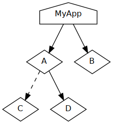

# The big override and overlay mega exercise

This project models a real-life project with simplified toy code and 
consists of five individual "mini-repos" in one big monorepo:

- `a/`
- `b/`
- `c/`
- `d/`
- `app/`

These have the following dependency tree:

## Exercises

### Exercise 1

(Only change the content of `release.nix` in this exercise.)

- Add a new attribute with the name `myapp-patched` in `release.nix`
  - This attribute shall produce a package that prints "xyzw" instead of "abcd" when run
  - Find out how to do this using `override` and `overrideAttrs`
- Build and run the patched app with `$(nix-build release.nix -A myapp-patched)/bin/MyApp`

### Exercise 2

(Only change the content of `release.nix` and `overlay-patches.nix` in this exercise.)

- Add a new file `overlay-patches.nix`.
  - This overlay shall perform all the overrides on the original libA/B/C/D packages.
  - Don't use `callPackage` in this file. Access the existing packages via `prev....`
- Add the new overlay file to the `overlays = [ ... ]` list in the nixpkgs import block in `release.nix`
- Build and run the patched app with `$(nix-build)/bin/MyApp`
  - This is the original app attribute. It should not be available without patches anymore